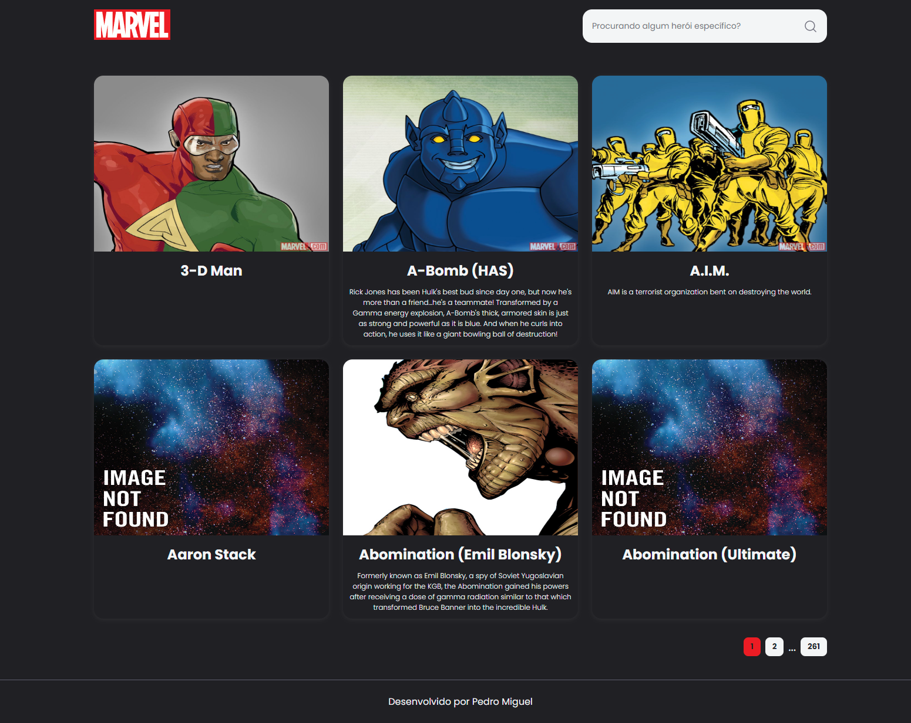

<h1 align="center" style="color:white; font-size: 2.6rem; line-height: 3.9rem;font-weight: 700;">
    Desafio Frontend
</h1>

<p align="center">
  <a href="#-tecnologias">Tecnologias</a>&nbsp;&nbsp;&nbsp;|&nbsp;&nbsp;&nbsp;
  <a href="#-como-executar-o-projeto">Como executar o projeto?</a>
</p>

<p align="center">
  

  

  <a href="https://github.com/pedromiiguel/Marvel/commits/master">
    
  </a>

   <a href="https://github.com/pedromiiguel/Marvel/stargazers">
    
  </a>
</p>

<br/>

<h1 align="center">
     
</h1>

## 🚀 Tecnologias

Tecnologias utilizazadas no projeto:

- [TypeScript](https://www.typescriptlang.org/)
- [Vite](https://vitejs.dev/)
- [Styled Components](https://styled-components.com/)
- [Eslint](https://eslint.org/)
- [Prettier](https://prettier.io/)
- [React Query](https://tanstack.com/query/latest)
- [Axios](https://axios-http.com/ptbr/docs/intro)
- [React Router Dom](https://reactrouter.com/en/main)
- [Jest](https://jestjs.io/pt-BR/)
- [React Testing Libray](https://testing-library.com/)
- [MSW](https://mswjs.io/)


### Pré-requisitos

<p> É necessário possuir o Node.js instalado na máquina </p>
<p>E também possuir um gerenciador de tarefas NPM ou Yarn.</p>


## 🔧 Como executar o projeto

```bash
# Clone este repositório
$ git clone https://github.com/pedromiiguel/Marvel.git

# Acesse a pasta do projeto no terminal/cmd
$ cd challenge-fpass

# Instale as dependências
$ npm install ou yarn

# Execute a aplicação em modo de desenvolvimento
$ npm dev ou yarn dev

# O servidor inciará na porta:3000 - acesse http://127.0.0.1:5173/
```

## :man_astronaut: Autor

#### Pedro Miguel

- Git Hub: <a href="https://github.com/pedromiiguel" target="_blank" >@pedromiiguel</a>
- Linkedin: <a href="https://www.linkedin.com/in/pedro-miiguel" target="_blank" >@pedromiiguel</a>